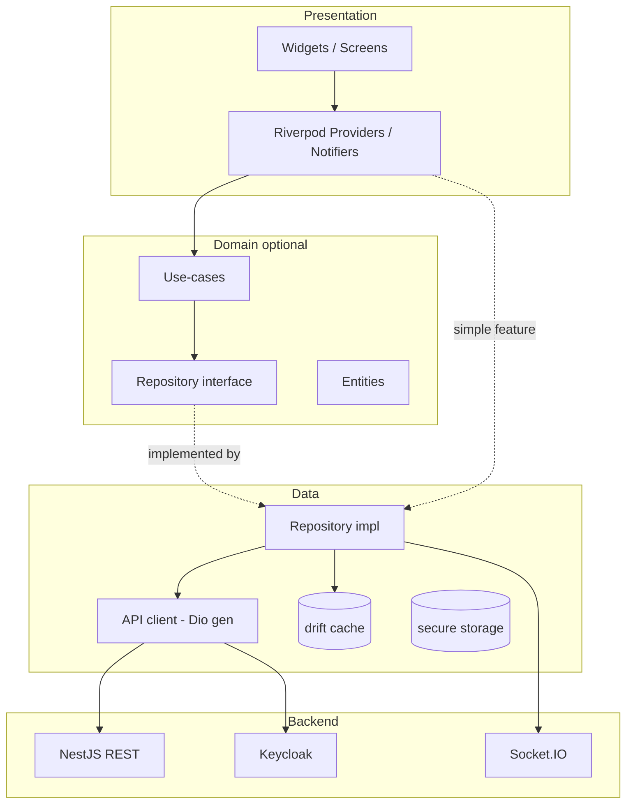

# 01 — Architecture Overview

> How the Flutter app is structured at a high level, and the principles that govern every decision.

---

## 1. Goals

1. **Feature parity path** with the web learner app (BJT practice, flashcards/SRS, reading assist, battle, profile, monetization-aware UI).
2. **Offline-first** for study content (cached), **online-only** for exam/battle integrity.
3. **Production-grade from commit one** — no demo state, no localStorage-equivalent for persistent domain data.
4. **Maintainable at scale** — a new feature should be addable without touching unrelated modules.

---

## 2. Core principles

### 2.1 Feature-first

Each feature is a vertical slice. All code for "flashcard" lives under `lib/features/flashcard/`. Cross-feature sharing goes through `lib/core/` (infra) or `lib/shared/` (UI/utils). Features must **not** import each other's internals — communicate via shared domain models or router navigation.

### 2.2 Clean-lite (pragmatic layering)

```
presentation  →  domain (optional)  →  data
   (UI +            (entities,           (repository impl,
    providers)       use-cases,           api client, dto,
                     repo interface)       local cache)
```

- **Simple feature (CRUD)**: skip `domain`. The repository returns models directly; providers call the repository.
- **Complex feature**: add `domain` with entities + repository interface + use-cases (e.g. SRS scheduler, battle reducer).

> Rule: do not add a layer "just in case". Add `domain` only when business logic would otherwise leak into providers or repositories. Matches the project "simple until proven complex" principle.

### 2.3 Server-authoritative

| Data | Where it lives | Local role |
|------|----------------|-----------|
| Learning progress, SRS state, settings, skip-state | **Backend (Postgres)** | cached + sync queue |
| Auth tokens | **flutter_secure_storage** | secure, encrypted |
| Cached content (decks, lessons) | **drift** | read cache, TTL/invalidation |
| Ephemeral UI (modal open, tab index) | Riverpod state | in-memory only |

The app **never** treats local DB as truth for domain data. On reconnect, the sync queue pushes pending mutations and pulls server state.

### 2.4 Unidirectional data flow

```
UI event → Notifier method → Repository → API/cache
                 ↓
           new state emitted → UI rebuilds (ref.watch)
```

No widget mutates repository/data directly; everything routes through a provider/notifier.

---

## 3. Tech stack (locked)

| Concern | Package | Version policy |
|---------|---------|----------------|
| State | `flutter_riverpod`, `riverpod_annotation` + `riverpod_generator` | 2.x |
| Routing | `go_router` | latest stable |
| HTTP | `dio` | 5.x |
| Models | `freezed`, `json_serializable` | latest |
| API client | generated via `openapi-generator` (dio) or `swagger_parser` | — |
| Local DB | `drift` (+ `sqlite3_flutter_libs`) | latest |
| Secure storage | `flutter_secure_storage` | latest |
| Auth | `flutter_appauth` | latest |
| Realtime | `socket_io_client` | matches backend Socket.IO major |
| i18n | `slang` (+ `slang_flutter`) | latest |
| Lint | `very_good_analysis` | latest |
| Crash/observability | `sentry_flutter` | latest |
| Env/flavors | `--dart-define` + `flutter_flavorizr` (optional) | — |

> Do not add packages outside this list without recording it in the decision table (README). Keep dependency surface small.

---

## 4. Layer model (diagram)



---

## 5. Module dependency rules

- `features/*` may depend on `core/*` and `shared/*`.
- `core/*` must **not** depend on `features/*`.
- `shared/*` (UI widgets, utils) must **not** depend on `features/*`.
- Features must not import another feature's `data/` or `presentation/` internals. If two features share an entity, promote it to `core/models` or a shared package.

Enforce with `custom_lint` / import lint rules where practical.

---

## 6. Data flow examples

### 6.1 Load flashcard deck (offline-first read)

```
Screen mounts
  → ref.watch(deckListProvider)
  → DeckRepository.getDecks()
      → emit cached decks from drift (instant)
      → fetch /decks from API
      → upsert into drift → reactive query re-emits fresh data
```

### 6.2 Submit SRS review (server-authoritative write)

```
User rates card
  → ReviewNotifier.submit(cardId, grade)
  → ReviewRepository.submitReview(...)
      → if online: POST /srs/review → update drift from response
      → if offline: enqueue mutation in sync_queue, optimistic local update
  → SyncService flushes queue on reconnect (idempotent, server reconciles)
```

### 6.3 Battle (online-only)

```
Enter battle → connect Socket.IO (auth token) → event-driven state via Notifier
No offline fallback; show connectivity guard if disconnected.
```

---

## 7. What this architecture deliberately avoids

- ❌ Global singletons holding business state (use scoped providers).
- ❌ A monolithic `domain` layer forced on trivial features.
- ❌ Hand-written API DTOs that drift from backend contract.
- ❌ Storing progress/settings only on device.
- ❌ Frontend-only paywall/quota checks.
- ❌ Mixing two state-management libraries.

Next: [02 — Project structure & conventions](02-project-structure.md)
