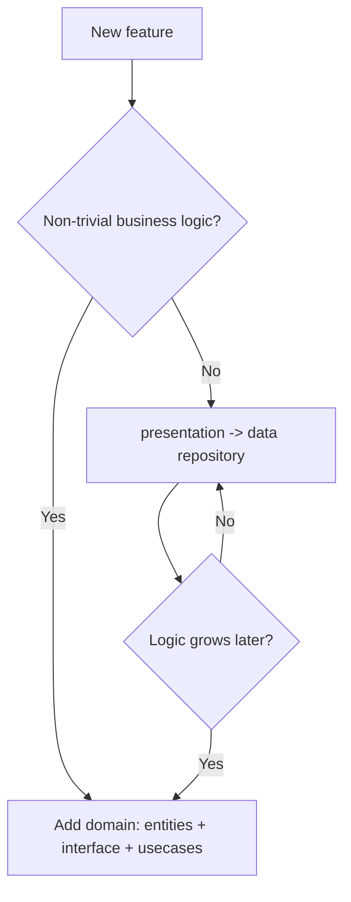

# 02 — Project Structure & Conventions

> Exact folder layout, file naming, and feature anatomy. Follow this so every feature looks the same.

---

## 1. Top-level layout

```
apps/mobile/
  android/  ios/  web/            # platform shells (web optional)
  lib/
    main.dart                     # entrypoint per flavor (main_dev / main_prod)
    bootstrap.dart                # ProviderScope, error zone, Sentry init
    app.dart                      # MaterialApp.router + theme + i18n

    core/                         # cross-cutting infrastructure (NO feature deps)
      config/                     # env, flavor, constants, endpoints
      network/                    # Dio, interceptors, error model
      auth/                       # Keycloak OIDC service, token store, session
      router/                     # go_router config + guards + routes
      storage/                    # drift db, secure storage, sync queue
      realtime/                   # Socket.IO client wrapper
      theme/                      # design tokens, ThemeData, text styles
      i18n/                       # slang generated + ARB/json sources
      error/                      # failure types, error -> UI mapping
      observability/              # logger, Sentry helpers

    shared/                       # reusable UI + utils (NO feature deps)
      widgets/                    # design-system components (buttons, cards…)
      japanese/                   # Reading Assist layer: JapaneseText, furigana
      formatters/  extensions/  utils/

    features/
      <feature>/
        data/
          dto/                    # generated/serialized DTOs (or reuse api_client)
          datasources/            # remote (api) + local (drift) sources
          repositories/           # repository implementation
        domain/                   # OPTIONAL (see §4)
          entities/
          repositories/           # abstract interface
          usecases/
        presentation/
          providers/              # riverpod notifiers/providers (codegen)
          screens/                # full pages
          widgets/                # feature-local widgets
        <feature>.dart            # barrel export (public surface only)

  packages/                       # OPTIONAL internal packages (Melos)
    api_client/                   # generated OpenAPI client
    design_system/                # if you extract shared/widgets + theme

  test/                           # unit + widget tests mirror lib/
  integration_test/               # e2e flows
  pubspec.yaml
  analysis_options.yaml           # very_good_analysis + custom rules
```

---

## 2. Feature list (initial)

Mirror the web learner surfaces:

```
features/
  auth/            # login (social via Keycloak), session, profile bootstrap
  home/            # dashboard, daily plan
  bjt_practice/    # BJT question sets, exam mode, scoring
  flashcard/       # decks, SRS review, add-to-deck
  reading/         # reading assist content, articles (NHK-style)
  battle/          # realtime battle (Socket.IO)
  profile/         # settings, progress, entitlements display
  monetization/    # plans/upgrade UI (gating rendered from backend entitlements)
```

---

## 3. Naming conventions

| Thing | Convention | Example |
|-------|-----------|---------|
| Files | `snake_case.dart` | `flashcard_repository.dart` |
| Classes/Types | `PascalCase` | `FlashcardRepository` |
| Providers (codegen) | function `camelCase`, generated provider `camelCaseProvider` | `deckList` → `deckListProvider` |
| Notifiers | `PascalCase` + `Notifier` | `ReviewNotifier` |
| Freezed models | `PascalCase` | `Deck`, `ReviewResult` |
| Repository interface | `<Name>Repository` (abstract) in `domain` | `SrsRepository` |
| Repository impl | `<Name>RepositoryImpl` in `data` | `SrsRepositoryImpl` |
| Screens | `<Name>Screen` | `FlashcardReviewScreen` |
| Routes | `kebab-case` paths, typed route classes | `/flashcard/review` |
| i18n keys | dotted namespaces | `flashcard.review.again` |

---

## 4. When to add the `domain` layer

Add `domain/` **only** if at least one is true:

- The feature has business rules independent of UI/API (e.g. SRS interval calculation, battle scoring, exam timing).
- Multiple data sources must be coordinated behind one interface.
- You need use-cases reused by more than one provider.

Otherwise (simple list/detail/CRUD), `presentation` calls `data/repositories` directly. **Do not** create empty pass-through interfaces.

### Decision flow



---

## 5. Feature anatomy — concrete example (flashcard, simple)

```
features/flashcard/
  data/
    datasources/
      flashcard_remote_ds.dart    # uses generated api_client
      flashcard_local_ds.dart     # drift queries
    repositories/
      flashcard_repository.dart    # combines remote + local (offline-first)
  presentation/
    providers/
      deck_list_provider.dart      # @riverpod deckList
      review_notifier.dart         # @riverpod class ReviewNotifier
    screens/
      deck_list_screen.dart
      review_screen.dart
    widgets/
      flashcard_view.dart
      grade_buttons.dart
  flashcard.dart                   # exports screens + providers used by router
```

For SRS (has scheduling logic) you would additionally add `domain/usecases/compute_next_review.dart`.

---

## 6. Barrel exports & encapsulation

- Each feature exposes a barrel `<feature>.dart` exporting **only** what the router/other layers need (usually screens + a few providers).
- Internal widgets/datasources are **not** exported.
- Router imports feature barrels, never deep paths.

---

## 7. Code generation workflow

```bash
# one-off
dart run build_runner build --delete-conflicting-outputs
# during development
dart run build_runner watch --delete-conflicting-outputs
```

Generators in use: `riverpod_generator`, `freezed`, `json_serializable`, `slang`, `drift_dev`.

Generated files (`*.g.dart`, `*.freezed.dart`) are committed-optional — recommend **gitignore** them and generate in CI to avoid merge noise. Decide once and document in repo memory.

---

## 8. analysis_options.yaml baseline

```yaml
include: package:very_good_analysis/analysis_options.yaml

analyzer:
  plugins:
    - custom_lint
  errors:
    invalid_annotation_target: ignore   # riverpod/freezed codegen noise
  exclude:
    - "**/*.g.dart"
    - "**/*.freezed.dart"
    - "lib/core/i18n/**"                 # slang generated

linter:
  rules:
    public_member_api_docs: false        # not a published package
    prefer_const_constructors: true
```

Next: [03 — State management (Riverpod)](03-state-management-riverpod.md)
