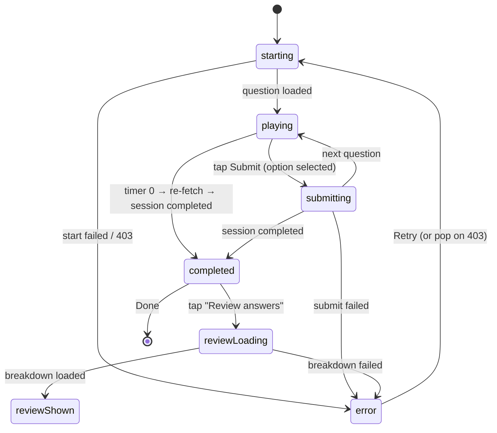
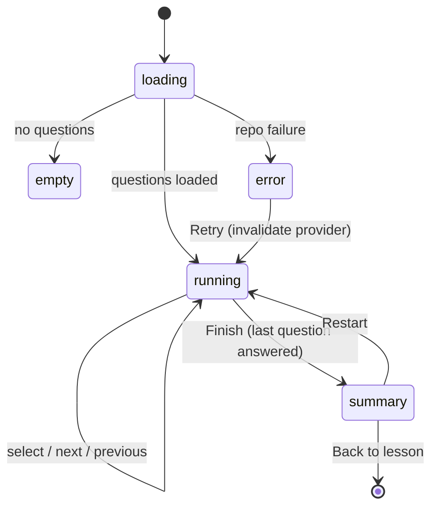

# Exam / Practice — State Machine

> Documents both flows. CTA must be deterministic: never enabled when it cannot
> act. Tapping the advance CTA must advance exactly once.

## A. Exam Mode (real `/api/quiz`) — `ExamPlayerPage._Phase`

States: `starting → playing ⇄ submitting → completed`, plus `error`.
New (Batch 4): `reviewLoading → reviewShown` reachable from `completed`.

| State | User actions | Disabled | CTA label | API call | UI |
| --- | --- | --- | --- | --- | --- |
| starting | back | submit | — | `POST /quiz/start` → `GET …/question` | skeleton |
| playing | select option, back | submit until option chosen | `Nộp bài` (Submit) | none | question + timer + options |
| submitting | — (locked) | options, submit | `Nộp bài` (loading) | `POST …/answer` | spinner on CTA |
| completed | Review, Done | — | `Xem lại` / `Xong` | none | score + band |
| reviewLoading | back | review | — | `GET …/results/breakdown` | skeleton |
| reviewShown | filter, save card, back | — | `Xong` | optional `POST add-from-remediation` | per-question list |
| error | Retry / Upgrade→back | — | `Thử lại` | re-run start/breakdown | error state |

Tests required: start success, start 403→upgrade, question load, select enables
submit, submit→next, submit→completed, timeout→completed, breakdown success,
breakdown error, repeated submit tap does not double-submit (`_phase` guard).

### Timer sub-states
- `remainingSeconds == null` → no timer shown (untimed template).
- counting down → `_TimerPill`; `≤ 60s` → danger color.
- reaches 0 → cancel local timer, re-fetch question; server auto-expires →
  `completed`. No fake auto-submit; only answered questions counted server-side.

## B. Lesson Practice (local preview) — `PracticeSessionState` + `_finished`

States: `loading → (empty | error | running) → summary`.

| State | User actions | Disabled | CTA | API | UI |
| --- | --- | --- | --- | --- | --- |
| loading | — | all | — | `fetchQuestions` | skeleton |
| empty | back | — | — | — | empty state |
| error | retry, back | — | `Thử lại` | invalidate | error state |
| running (not answered) | select option, previous | Next/Finish | `Tiếp` / `Hoàn thành` (disabled) | none | question + options |
| running (answered, mid) | select, previous, next | — | `Tiếp` (enabled) | none | question |
| running (answered, last) | select, previous, finish | — | `Hoàn thành` (enabled) | none | question |
| summary | restart, back, review | — | `Làm lại` / `Quay lại` | none | score + per-question review |

Invariant: the advance CTA is enabled only when `state.isCurrentAnswered`.
Reaching the last question requires answering all prior ones (no skip), so an
answered last question is always a complete set → Finish never appears enabled
while it cannot act. `next()`/`previous()` are no-ops at bounds, so repeated
taps cannot strand the user or double-advance.

Tests required: submit disabled before selection, enabled after, Next advances
Q1, Next advances a middle question, last question Finish → summary, repeated
Next does not double-advance, error state, empty state, summary reachable.

## C. Offline / backend-unreachable

- `ApiClient` raises `NetworkApiException` → `RepositoryException`
  (`RepositoryErrorKind.network`). Exam states render the shared
  `ErrorStateView` with Retry. No cached/fake questions or scores are shown.
- Practice is local: it does not require the network and never shows a network
  error for its own questions.
- If the backend runtime is down during QA, exam screens correctly show the
  error/Retry state. This is documented as **runtime verification blocked**, not
  a code defect — the contract is implemented against the real endpoints.
