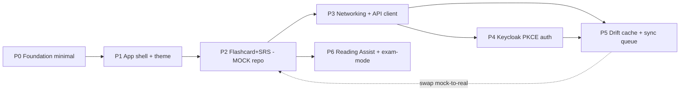

# Mobile Implementation Plan — NihonGo BJT (Flutter)

> Execution plan for building the Flutter mobile app per the architecture in `docs/mobile/01–08`.
> Stack: **Riverpod 2.x (codegen) + go_router + Dio + repository pattern + freezed + drift**, layered `data/domain/presentation` (domain optional per feature — see [02 §4](02-project-structure.md)).
> **This document is a plan only. No application code is written in this step.**
>
> **Sequencing strategy:** get a *runnable vertical slice (Flashcard + SRS) on a mock repository early*, before any backend dependency. Networking, Auth, and Storage are **integration phases** layered in afterward by swapping the mock repository for a real one behind the same interface — no UI/notifier rewrite. This de-risks delivery: the app demos and tests end-to-end without Keycloak / OpenAPI / drift being ready.
>
> Conventions and patterns referenced here are defined in:
> [01 Architecture](01-architecture-overview.md) · [02 Structure](02-project-structure.md) · [03 Riverpod](03-state-management-riverpod.md) · [04 Networking](04-networking-api-client.md) · [05 Auth](05-auth-keycloak.md) · [06 Offline](06-offline-sync-storage.md) · [07 Design](07-design-system-ui.md) · [08 Testing/CI](08-testing-ci-cd.md)

---

## How to read this plan

- Each phase lists: **Goal → Dependencies/Blockers → Files (create/modify) → Acceptance criteria → Verify → Rollback/Fallback**.
- A phase is "done" only when every acceptance item passes and verify commands are green ([08 §5 Definition of Done](08-testing-ci-cd.md)).
- File paths are relative to `apps/mobile/` unless noted.
- Backend contract details the docs do not specify are **not guessed** — see [Open Questions](#open-questions).

### Phase dependency graph



> P2 ships on a **mock repository** behind the same interface the real repository (P3/P5) will implement. Swapping is a DI override, not a rewrite ([03 §3 DI](03-state-management-riverpod.md), [03 §9 testing overrides](03-state-management-riverpod.md)).

### Global verify commands (end of every phase)

```bash
cd apps/mobile
dart run build_runner build --delete-conflicting-outputs
dart format --set-exit-if-changed .
flutter analyze
flutter test            # once tests exist (P0+)
```

---

## Phase 0 — Foundation minimal

> **Status: ✅ Done.** App scaffolded at `apps/mobile` (Flutter 3.44.0 / Dart 3.12.0, android+ios). Verified: `flutter pub get`, `dart format` (clean), `flutter analyze` (No issues), `flutter test` (1 passing smoke test).
> **Deviations from the original outline (intentional, per "no unused deps / no fake code"):**
> - **Codegen toolchain deferred to P2.** No `@riverpod`/freezed targets exist yet, so `build_runner`/`riverpod_generator`/`freezed`/`json_serializable` are not added (they would be unused). Plain `flutter_riverpod` is used for `ProviderScope` + a `Provider<GoRouter>`.
> - **No `dio`** (no real ApiClient until P3).
> - **`features/flashcards/`** holds only a `README.md` seam (module boundary); real code lands in P2.
> - Custom fonts (Inter/Noto Sans JP) deferred to P1; theme ships color + shape tokens now.

**Goal:** A runnable, analyzable empty Flutter app with Riverpod + go_router + codegen toolchain wired. One flavor (`dev`) is enough here; staging/prod added in P3 when env URLs matter. No theme polish, no features.

**Dependencies/Blockers:** Q1 (monorepo placement), Q10 (commit vs gitignore codegen) — **required before this phase**.

### Files to create
- `pubspec.yaml` — minimal deps: `flutter_riverpod`, `riverpod_annotation`, `go_router`, `freezed_annotation`, `json_annotation`; dev: `build_runner`, `riverpod_generator`, `freezed`, `json_serializable`, `very_good_analysis`. *(Dio/drift/appauth/slang/sentry added in their integration phases.)*
- `analysis_options.yaml` — per [02 §8](02-project-structure.md).
- `lib/main.dart` — single entrypoint calling `bootstrap()` (flavor entrypoints added P3).
- `lib/bootstrap.dart` — `runZonedGuarded` + `ProviderScope` (Sentry added P3).
- `lib/app.dart` — `MaterialApp.router` with default theme + router.
- `lib/core/router/router.dart` — `GoRouter` with one placeholder `/` route (no guard yet).
- `lib/core/config/env.dart` — `EnvConfig` stub with hardcoded dev defaults (real `fromDefines()` in P3).
- `test/smoke_test.dart` — app boots without throwing.
- `apps/mobile/README.md` — run/build commands, codegen workflow.
- `.gitignore` — codegen artifacts per Q10 decision.

### Files to modify
- Root repo docs / `pnpm-workspace.yaml` — mark `apps/mobile/` as a Flutter app excluded from pnpm (per Q1).

### Acceptance criteria
- [ ] `flutter run` boots to a placeholder screen.
- [ ] `build_runner` runs clean (even with no generated targets yet).
- [ ] `flutter analyze` passes zero issues under `very_good_analysis`.
- [ ] Smoke test passes.

### Verify
```bash
flutter pub get
dart run build_runner build --delete-conflicting-outputs
dart format --set-exit-if-changed .
flutter analyze
flutter test
```

### Rollback/Fallback
- Self-contained; no external dependency. If codegen tooling misbehaves, pin generator versions in `pubspec.yaml` and re-run. Nothing to fall back from.

---

## Phase 1 — App shell + theme/design tokens (minimal)

**Goal:** Themed shell with design tokens, typography, bottom navigation, and the minimum shared-widget states (skeleton/empty/error) needed by P2. Enough design system to make the Flashcard slice look production-grade — not the full kit (finalized in P6).

**Dependencies/Blockers:** P0. No external blockers (tokens come from `DESIGN.md`, fully specified).

### Files to create
- `lib/core/theme/tokens.dart`, `typography.dart`, `app_theme.dart` — from [07 §1–3](07-design-system-ui.md).
- `assets/fonts/` + `pubspec.yaml` fonts — Noto Sans JP + Inter ([07 §2](07-design-system-ui.md)).
- `lib/shared/widgets/skeleton.dart`, `empty_state.dart`, `error_retry.dart`, `app_button.dart`, `app_card.dart` — minimal but production-grade ([07 §4](07-design-system-ui.md)).
- `lib/shared/widgets/bottom_nav_bar.dart` — primary navigation shell.
- `lib/core/i18n/` — slang config + `vi`/`ja` skeleton (keys for shell + states). *(Or defer slang — see Fallback.)*
- `test/shared/widgets/states_test.dart` — skeleton/empty/error render.

### Files to modify
- `lib/app.dart` — apply theme.
- `lib/core/router/router.dart` — `ShellRoute` + placeholder tabs (Home placeholder, Flashcard placeholder).

### Acceptance criteria
- [ ] App renders Navy/Blue tokens + bundled Noto Sans JP / Inter fonts.
- [ ] Bottom nav switches between placeholder tabs.
- [ ] Skeleton/empty/error widgets render and meet micro-review rules (touch ≥48dp, press/focus feedback, consistent radius) ([07 §4](07-design-system-ui.md)).
- [ ] All shell copy via i18n keys (or temporary typed strings if slang deferred).

### Verify
```bash
dart run build_runner build --delete-conflicting-outputs
flutter analyze
flutter test test/shared
```

### Rollback/Fallback
- If `slang` setup is not ready, use a temporary `lib/core/i18n/strings.dart` typed-constants file with the **same key names**; migrate to slang in P6 without touching call sites. Honors "no raw literals" without blocking on i18n tooling.

---

## Phase 2 — Flashcard + SRS vertical slice (MOCK repository)

**Goal:** The first fully runnable, testable feature — deck list + SRS review — backed by a **mock repository** with seeded in-memory data. Full `data/domain/presentation` layering and the real repository **interface** are defined now; only the implementation is mock. Proves the architecture end-to-end with **zero backend dependency**.

**Dependencies/Blockers:** P1. **No backend blockers** (Q5/Q8 deferred to P3/P5). This is the key de-risking phase.

### Files to create
**Domain (real, permanent):**
- `lib/features/flashcard/domain/entities/deck.dart`, `card.dart`, `review_result.dart`, `srs_grade.dart` (freezed/enums).
- `lib/features/flashcard/domain/repositories/flashcard_repository.dart` — **abstract interface** (contract both mock and real impls satisfy).
- `lib/features/flashcard/domain/usecases/compute_next_review.dart` — SRS scheduler (pure logic, fully testable now) ([02 §5](02-project-structure.md)).

**Data (mock now, real later):**
- `lib/features/flashcard/data/repositories/mock_flashcard_repository.dart` — in-memory seeded decks/cards; simulates latency + optional offline toggle.
- `lib/features/flashcard/data/fixtures/seed_decks.dart` — linguistically accurate seed data (real JP/VI, marked as seed) per project data-quality rules.

**Presentation (real, permanent):**
- `lib/features/flashcard/presentation/providers/flashcard_repository_provider.dart` — provides `flashcardRepository`, **bound to mock impl here** ([03 §3](03-state-management-riverpod.md)).
- `lib/features/flashcard/presentation/providers/deck_list_provider.dart` ([03 §4](03-state-management-riverpod.md)).
- `lib/features/flashcard/presentation/providers/review_notifier.dart` — optimistic update ([03 §5](03-state-management-riverpod.md)).
- `lib/features/flashcard/presentation/screens/deck_list_screen.dart`, `review_screen.dart`.
- `lib/features/flashcard/presentation/widgets/flashcard_view.dart`, `grade_buttons.dart`.
- `lib/features/flashcard/flashcard.dart` — barrel.

**Tests:**
- `test/features/flashcard/compute_next_review_test.dart` — SRS interval per grade.
- `test/features/flashcard/review_notifier_test.dart` — optimistic update + reconcile against mock.
- `test/features/flashcard/deck_list_provider_test.dart` — loading/empty/data via mock override.
- `test/features/flashcard/deck_list_screen_test.dart` — renders all states.

### Files to modify
- `lib/core/router/router.dart` — real `/flashcard`, `/flashcard/review` routes replacing placeholder.

### Acceptance criteria
- [ ] Deck list + review run fully against the mock repository, no network/auth/db.
- [ ] `FlashcardRepository` **interface** is final and documented; mock + (future) real impls both satisfy it.
- [ ] `computeNextReview` unit-tested for every `SrsGrade`.
- [ ] Review applies optimistically and reconciles with mock response ([03 §5](03-state-management-riverpod.md)).
- [ ] Screens render loading skeleton / empty / error / data ([03 §4](03-state-management-riverpod.md)).
- [ ] No logic in widgets; mutations only in notifiers ([03 §10](03-state-management-riverpod.md)).
- [ ] Seed data linguistically accurate and clearly marked as seed.
- [ ] Swapping repository impl is a **single provider override** (proven by tests overriding with a second fake).

### Verify
```bash
dart run build_runner build --delete-conflicting-outputs
flutter analyze
flutter test test/features/flashcard
flutter run            # manual: browse decks, review cards on mock data
```

### Rollback/Fallback
- This phase *is* the fallback baseline. If later integration (P3/P5) stalls, the app still ships a working Flashcard slice on the mock repository. The mock impl is retained permanently for tests and offline-dev.

---

## Phase 3 — Networking & generated API client (integration)

**Goal:** Real Dio client + interceptors + error mapping + API client generated from `docs/openapi.json`. Introduce flavors/env + Sentry. Does **not** yet replace the mock repo — provides the remote data source that P5's real repository will use.

**Dependencies/Blockers:** P2. **Q2** (generator choice) required before this phase. **Q5/Q8** required before the real repository consumes these endpoints (in P5); networking scaffolding itself can proceed without them.

### Files to create
- `packages/api_client/` — generated client from `docs/openapi.json` ([04 §1](04-networking-api-client.md)).
- `scripts/check_openapi_drift.sh` — regenerate + fail on diff ([04 §1](04-networking-api-client.md), [08 §3](08-testing-ci-cd.md)).
- `lib/core/network/dio_provider.dart` ([04 §2](04-networking-api-client.md)).
- `lib/core/network/interceptors/{auth,retry,error_mapping,logging}_interceptor.dart` ([04 §3–5](04-networking-api-client.md)) — `auth_interceptor` token source is a no-op stub until P4.
- `lib/core/network/api_client_provider.dart`.
- `lib/core/error/failure.dart` ([04 §5](04-networking-api-client.md)).
- `lib/core/config/env.dart` (replace stub) — `fromDefines()` + flavors ([08 §2](08-testing-ci-cd.md)).
- `lib/main_dev.dart`, `lib/main_staging.dart`, `lib/main_prod.dart`.
- `lib/core/observability/sentry.dart`.
- `test/core/network/error_mapping_test.dart`, `retry_interceptor_test.dart`.

### Files to modify
- `pubspec.yaml` — add `dio`, `sentry_flutter`.
- `lib/bootstrap.dart` — accept `EnvConfig`, init Sentry.
- `lib/core/i18n/` — `errors.*` keys for failure→message mapping.
- `.github/workflows/mobile.yml` — add drift-check + multi-flavor build.

### Acceptance criteria
- [ ] API client generates cleanly from `docs/openapi.json` and compiles.
- [ ] Failures map: timeout→`NetworkFailure`, 401→`AuthFailure`, 422→`ValidationFailure`, 5xx→`ServerFailure` ([04 §5](04-networking-api-client.md)).
- [ ] Retry only idempotent methods on transient errors; never POST ([04 §4](04-networking-api-client.md)).
- [ ] Drift-check passes locally + CI.
- [ ] Flashcard slice **still runs on mock** (no regression).

### Verify
```bash
bash scripts/check_openapi_drift.sh
dart run build_runner build --delete-conflicting-outputs
flutter analyze
flutter test test/core/network
```

### Rollback/Fallback
- If `docs/openapi.json` is stale/incomplete (Q8 unresolved), generate against what exists and **do not** wire endpoints into the real repository yet — Flashcard stays on mock. Networking layer is independently testable with `dio` mock adapter.
- If generator choice (Q2) is undecided, scaffold interceptors + error model first (no generated client) so the phase isn't fully blocked.

---

## Phase 4 — Keycloak PKCE auth + session guards (integration)

**Goal:** Real login via Keycloak public client `nihongo-mobile` (PKCE), secure token storage, single-flight refresh, route guards, social buttons. Wires the real token source into the P3 auth interceptor.

**Dependencies/Blockers:** P3. **Q3** (client exists) + **Q4** (redirect URIs) — **required before this phase**. Hard external blocker: cannot implement against a guessed client.

### Files to create
- `lib/core/auth/keycloak_auth_service.dart` ([05 §3](05-auth-keycloak.md)).
- `lib/core/auth/token_store.dart` — secure storage ([05 §4](05-auth-keycloak.md)).
- `lib/core/auth/auth_tokens.dart`, `auth_state.dart` (freezed).
- `lib/core/auth/auth_session.dart` — single-flight `refresh()` ([05 §5](05-auth-keycloak.md)).
- `lib/core/router/guards.dart` — redirect + `GoRouterRefreshNotifier` ([05 §6](05-auth-keycloak.md)).
- `lib/features/auth/presentation/screens/login_screen.dart`.
- `lib/features/auth/presentation/widgets/social_button.dart` ([05 §7](05-auth-keycloak.md)).
- `lib/features/auth/auth.dart` — barrel.
- `test/core/auth/auth_session_test.dart` — single-flight refresh; logout wipes storage.
- `integration_test/auth_flow_test.dart`.

### Files to modify
- `pubspec.yaml` — add `flutter_appauth`, `flutter_secure_storage`.
- `lib/core/network/interceptors/auth_interceptor.dart` — wire real token + `QueuedInterceptor` dedup ([04 §3](04-networking-api-client.md)).
- `android/app/build.gradle`, `ios/Runner/Info.plist` — redirect scheme/URIs ([05 §2](05-auth-keycloak.md)).
- `lib/core/router/router.dart` — `/login` route + auth redirect guard.

### Acceptance criteria
- [ ] Fresh install → `/login`; after login → `/`.
- [ ] Tokens only in Keychain / EncryptedSharedPreferences ([05 §4](05-auth-keycloak.md)).
- [ ] Concurrent 401s → exactly one refresh, queued requests replay ([04 §3](04-networking-api-client.md), [05 §5](05-auth-keycloak.md)).
- [ ] System browser (AppAuth), not WebView ([05 §8](05-auth-keycloak.md)).
- [ ] `kc_idp_hint` social buttons open correct provider.
- [ ] Logout ends Keycloak session + clears storage.
- [ ] Security checklist [05 §8](05-auth-keycloak.md) satisfied.

### Verify
```bash
dart run build_runner build --delete-conflicting-outputs
flutter analyze
flutter test test/core/auth
flutter test integration_test/auth_flow_test.dart   # device/emulator
```

### Rollback/Fallback
- If Q3/Q4 unresolved: keep app on a **dev auth-bypass provider** (a fake `AuthSession` returning authenticated in `dev` flavor only) so downstream phases proceed. Flavor-gated, never compiled into staging/prod, removed once the Keycloak client is ready.
- Auth interceptor degrades gracefully: with no token source, requests go unauthenticated (only valid against open/dev endpoints).

---

## Phase 5 — Drift cache + sync queue + idempotency + real repository (integration)

**Goal:** drift database (cache + sync queue), connectivity, sync service, and the **real** `FlashcardRepositoryImpl` (offline-first read + queued idempotent writes) that **replaces the mock** via the existing provider — no UI/notifier changes.

**Dependencies/Blockers:** P3 (remote source) + P4 (auth for real calls). **Q5** (Idempotency-Key) + **Q8** (flashcard/SRS contract) — **required before real backend integration**.

### Files to create
- `lib/core/storage/app_database.dart` + `tables/{cache_meta,sync_queue,decks,cards,review_logs}.dart` ([06 §2](06-offline-sync-storage.md)).
- `lib/core/storage/sync_models.dart`, `sync_service.dart` ([06 §5](06-offline-sync-storage.md)), `connectivity_provider.dart` ([06 §8](06-offline-sync-storage.md)), `db_provider.dart`.
- `lib/features/flashcard/data/datasources/flashcard_remote_ds.dart` — uses generated api_client.
- `lib/features/flashcard/data/datasources/flashcard_local_ds.dart` — drift queries.
- `lib/features/flashcard/data/repositories/flashcard_repository_impl.dart` — offline-first + queued write ([04 §6](04-networking-api-client.md), [06 §3–4](06-offline-sync-storage.md)).
- `test/core/storage/sync_queue_test.dart`, `cache_ttl_test.dart`.
- `test/features/flashcard/flashcard_repository_impl_test.dart` — cache-then-remote; offline enqueue with idempotency key; replay no double-apply.

### Files to modify
- `pubspec.yaml` — add `drift`, `sqlite3_flutter_libs`, `connectivity_plus`, `drift_dev`.
- `lib/features/flashcard/presentation/providers/flashcard_repository_provider.dart` — **swap mock → real impl** (single override) ([03 §3](03-state-management-riverpod.md)).
- `lib/bootstrap.dart` — open db, trigger initial sync flush.
- `lib/core/network/api_client_provider.dart` — send queued `SyncItem` with `Idempotency-Key`.

### Acceptance criteria
- [ ] Deck list loads from cache instantly, then reconciles from API ([04 §6](04-networking-api-client.md)).
- [ ] Offline review enqueues with UUID `idempotencyKey`; replay does not double-apply ([06 §4](06-offline-sync-storage.md)).
- [ ] Sync flushes FIFO on reconnect; backoff; ≥5 attempts → failed ([06 §5](06-offline-sync-storage.md)).
- [ ] Logout wipes cache + queue + secure storage ([06 §7](06-offline-sync-storage.md)).
- [ ] Real repository passes the **same** notifier/screen tests the mock passed (no UI regression).
- [ ] No persistent domain data only in memory/SharedPreferences ([06 §9](06-offline-sync-storage.md)).

### Verify
```bash
dart run build_runner build --delete-conflicting-outputs
flutter analyze
flutter test test/core/storage test/features/flashcard
```

### Rollback/Fallback
- If Q5 (idempotency) unconfirmed: implement client-side key + queue anyway, but keep writes **online-only** (no offline enqueue) until server dedup verified — avoids double-apply risk. Document as temporary.
- If Q8 (contract) unconfirmed for some endpoints: real repo implements the confirmed subset and **falls back to mock impl** for unconfirmed parts via a composite repository, so the app never breaks.
- Worst case: revert the provider override → app returns to the mock repository (P2 baseline) with zero other changes.

---

## Phase 6 — Reading Assist + exam-mode suppression

**Goal:** Reusable `JapaneseText` Reading Assist layer (furigana, assist sheet, add-to-deck, exam-mode meaning suppression) and finalize the full shared-widget kit + slang i18n. Add-to-deck wires into the Flashcard repository (mock or real, whichever is active).

**Dependencies/Blockers:** P2 (flashcard repository interface for add-to-deck). **Q6** (`JpToken` shape) + **Q7** (exam-mode state source) — **required before this phase**; they block *only* Reading Assist, not the Flashcard MVP.

### Files to create
- `lib/shared/japanese/jp_token.dart` (freezed), `furigana_mode.dart`.
- `lib/shared/japanese/japanese_text.dart` ([07 §6](07-design-system-ui.md)).
- `lib/shared/japanese/reading_assist_sheet.dart` — reading/meaning/add-to-deck.
- `lib/shared/japanese/exam_mode_provider.dart` — source per Q7.
- `lib/shared/widgets/app_text_field.dart` — finalize remaining kit ([07 §4](07-design-system-ui.md)).
- `test/shared/japanese/japanese_text_test.dart` — furigana render; **exam mode hides meanings** ([08 §1](08-testing-ci-cd.md)).
- `test/golden/design_system_test.dart` — golden snapshots ([08 §1](08-testing-ci-cd.md)).

### Files to modify
- `lib/features/flashcard/...` — wire add-to-deck callback to `flashcardRepository.addCard(...)`.
- `lib/core/i18n/` — migrate temporary strings → slang (if deferred in P1); add assist-sheet keys.

### Acceptance criteria
- [ ] `JapaneseText` renders furigana (ruby) + opens assist sheet on tap.
- [ ] `examSafe: true` + exam active → meanings **not** revealed ([07 §6](07-design-system-ui.md)); covered by a passing test.
- [ ] Add-to-deck routes through the flashcard repository (server-authoritative when real, mock otherwise).
- [ ] Golden tests pass; reduced-motion + WCAG AA respected ([07 §8](07-design-system-ui.md)).

### Verify
```bash
dart run build_runner build --delete-conflicting-outputs
flutter analyze
flutter test test/shared test/golden
```

### Rollback/Fallback
- If Q6/Q7 unresolved: ship Flashcard MVP **without** Reading Assist (it is decoupled — add-to-deck can be a manual "+" button on cards meanwhile). `JapaneseText` lands when token contract + exam-state source are defined. No other phase depends on it.

---

## MVP scope summary

- **MVP (Phases 0–2, incl. P1 theme):** a runnable, themed Flashcard + SRS app on a **mock repository**, fully tested, no backend required.
- **Production MVP (Phases 0–5):** same app with real Networking + Keycloak auth + offline drift cache/sync replacing the mock — UI/notifiers unchanged.
- **Reading Assist (P6):** layers on top; **not** a blocker for either MVP milestone.

---

## Out of scope for MVP

In the architecture docs but **deferred** beyond this plan (folder placeholders only, per [02 §2](02-project-structure.md)):

- **BJT practice + exam-mode scoring** (`features/bjt_practice/`) — exam suppression primitive ships in P6, but the exam *feature* (online-only scoring flow) is out.
- **Realtime battle** (`features/battle/`, Socket.IO, `lib/core/realtime/`).
- **Reading/articles feature** (`features/reading/`) beyond the reusable `JapaneseText` layer.
- **Home dashboard / daily plan** (`features/home/` bento grid) — placeholder home only.
- **Profile & settings sync** (`features/profile/`) beyond logout.
- **Monetization UI** (`features/monetization/`, entitlement-gated rendering); `entitlementsProvider` (Q9).
- **Push notifications, background sync (WorkManager/BGTaskScheduler), deep links** beyond auth redirect.
- **Tablet two-pane layouts**, web platform target.
- **Store submission / Fastlane release automation** (CI builds artifacts; signing/deploy deferred).
- **Analytics event emission** beyond crash reporting.

---

## Cross-cutting Definition of Done (every feature-bearing phase)

From [08 §5](08-testing-ci-cd.md):

- [ ] Typed models; repository (offline-first where applicable).
- [ ] Riverpod providers/notifiers; no logic in widgets.
- [ ] All async surfaces render loading / empty / error states.
- [ ] Server-authoritative writes; idempotent queued mutations when offline-capable.
- [ ] i18n keys for all copy; no hardcoded strings.
- [ ] Entitlement/quota gating rendered from backend (no local paywall).
- [ ] Design tokens used; touch targets ≥48dp; press/hover/focus feedback.
- [ ] Unit tests for logic + widget smoke; critical behavioral tests where relevant.
- [ ] Verified at 375dp; floating elements never overlap.

---

## Open Questions

Not specified in the docs or require backend coordination. Grouped by which phase they block. **Do not guess.**

### Required before Foundation / Auth (P0, P4)

| # | Question | Blocks | Source |
|---|----------|--------|--------|
| Q1 | Monorepo placement: `apps/mobile/` in this repo vs separate repo. | **P0** | [README Decision record](README.md) |
| Q3 | Keycloak public client `nihongo-mobile` (PKCE, standard flow) in realm `nihongo-bjt` — exists? | **P4** | [05 §1](05-auth-keycloak.md) |
| Q4 | Redirect URIs: custom scheme `com.nihongobjt.app://oauth2redirect` and/or App Links/Universal Links domain + who hosts association file. | **P4** | [05 §1–2](05-auth-keycloak.md) |
| Q10 | Codegen artifacts (`*.g.dart`, `*.freezed.dart`): commit or gitignore + CI-generate? | **P0** | [02 §7](02-project-structure.md) |

> **Q3 — RESOLVED (2026-06-02):** The public client `nihongo-mobile` is now provisioned in realm `nihongo-bjt`. It is defined in `docker/keycloak/realm-export.json` (`publicClient: true`, `standardFlowEnabled: true`, `pkce.code.challenge.method = S256`, direct-access/implicit disabled) so a fresh Keycloak import has it. For an already-persisted Keycloak DB (import runs only once), `docker/keycloak/configure-realms-http.sh` now creates the client idempotently on container start (`ensure_mobile_client`). Previously the realm only had `nihongo-web`/`nihongo-admin`, so mobile sign-in failed with an invalid-client error ("Không thể đăng nhập").

> **Q4 — RESOLVED (2026-06-02):** Redirect strategy = custom scheme only (no App Links/association file for dev). `com.nihongobjt.app://oauth2redirect` is registered as a Valid Redirect URI on the `nihongo-mobile` client and matches the native manifests (Android `appAuthRedirectScheme=com.nihongobjt.app`, iOS URL type) and `AppEnvironment.oauthRedirectUri`. Post-logout redirect uses the same URI.

> **Q10 — RESOLVED (Phase 3.5, 2026-06-01):** Generated API artifacts (the OpenAPI contract `docs/openapi.json`/`apps/api/openapi/openapi.json`, and on the Flutter side the future generated client + `*.g.dart`/`*.freezed.dart`) **are committed** to the repo. Rationale: reproducible builds, reviewable contract diffs, no codegen needed for a fresh checkout to compile. **Generated code is never hand-edited** — it is regenerated from source. The OpenAPI generator command is documented: `pnpm --filter @nihongo-bjt/api openapi:generate` (boots `AppModule` via NestJS Swagger; deterministic output). Dart codegen command stays `dart run build_runner build --delete-conflicting-outputs`. CI should run the generator and fail on drift (`scripts/check_openapi_drift.sh`, P3).

> **Q1–Q4 are required before Foundation/Auth can start.** (Q2 below is also required before networking.)

### Required before real backend integration (P3, P5)

| # | Question | Blocks | Source |
|---|----------|--------|--------|
| Q2 | API client generator: `openapi-generator` (dart-dio) vs `swagger_parser` (freezed). | **P3** | [04 §1](04-networking-api-client.md) |
| Q5 | Backend `Idempotency-Key` (header/body) on mutations (`POST /srs/review`, settings, progress)? | **P5** | [06 §4](06-offline-sync-storage.md), [08 §7](08-testing-ci-cd.md) |
| Q8 | Flashcard/SRS contract: endpoint paths, SRS grade enum values, review response shape. | **P3 (wire), P5 (consume)** | [04 §6](04-networking-api-client.md), [06 §4](06-offline-sync-storage.md) |

> **Q8 — RESOLVED (Phase 3.5, 2026-06-01):** Real endpoints documented in `docs/openapi.json` with typed schemas (note: differ from earlier *proposed* names — proposed names do **not** exist in the backend):
> - `GET /api/flashcards/decks` → `FlashcardDeckOpenApiDto[]` (note titles are `titleVi`/`titleJa`, card count via `_count.cards`).
> - `GET /api/flashcards/reviews/due` → `FlashcardReviewItemOpenApiDto[]` *(the real "review cards" queue; not `/decks/{deckId}/review-cards`)*.
> - `POST /api/flashcards/reviews/:userFlashcardId` (body `SubmitFlashcardReviewRequestOpenApiDto`) → `SubmitFlashcardReviewResponseOpenApiDto` *(not `/review-events`)*.
> - `POST /api/flashcards/reviews/batch` (body `SubmitFlashcardReviewBatchRequestOpenApiDto`) → `SubmitFlashcardReviewBatchResponseOpenApiDto` (per-`clientMutationId` results).
>
> SRS grade enum = `again | hard | good | easy`. All four endpoints require Bearer auth + `userId` (query for GET, body for POST). A type-safe `ApiFlashcardRepository` (P5) can now be generated against these schemas.

> **Q5/Q8 are required before real backend integration.** Until resolved, the app runs on the P2 mock repository.

### Required before Reading Assist only (P6)

| # | Question | Blocks | Source |
|---|----------|--------|--------|
| Q6 | `JpToken` shape — does backend return per-token reading/meaning/JLPT level, or must the app tokenize? Source endpoint? | **P6 only** | [07 §6](07-design-system-ui.md) |
| Q7 | Exam-mode state source: backend session flag vs client navigation state for `examModeProvider`. | **P6 only** | [07 §6](07-design-system-ui.md) |

> **Q6/Q7 block only Reading Assist (P6).** They do not block the Flashcard MVP.

### Post-MVP

| # | Question | Blocks | Source |
|---|----------|--------|--------|
| Q9 | Entitlements endpoint (`/me/entitlements`) shape for client gating. | Monetization (out of MVP) | [03 §6](03-state-management-riverpod.md), [08 §7](08-testing-ci-cd.md) |

---

## Next action after approval

1. Resolve **Q1, Q10** → start **P0**, then **P1**.
2. **P2** → runnable, tested Flashcard + SRS slice on mock data (no backend).
3. Resolve **Q2, Q8** → **P3**; resolve **Q3, Q4** → **P4**; resolve **Q5** → **P5** (swap mock → real).
4. Resolve **Q6, Q7** → **P6** (Reading Assist), any time after P2.

No code is written until this plan is approved and the blocking Open Questions for the targeted phase are resolved.
