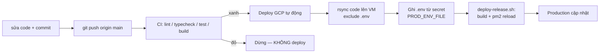

# NihonGo BJT — CI/CD with GitHub Actions → Google Cloud

Hướng dẫn vận hành pipeline tự động build + deploy lên Google Cloud VM mỗi khi
push code lên `main`, kèm cách quản lý biến môi trường (`.env`) an toàn.

## Tổng quan luồng



- CI chạy mỗi push lên `main` và mỗi Pull Request.
- Deploy **chỉ** chạy sau khi CI trên `main` kết thúc với kết quả `success`.
- CI fail → không deploy → production giữ nguyên bản cũ an toàn.

## Workflow files

| File | Vai trò |
| --- | --- |
| `.github/workflows/ci.yml` | Build + kiểm thử (lint, typecheck, test, prisma, openapi, build) |
| `.github/workflows/deploy-gcp.yml` | Deploy lên GCP VM qua SSH, kích hoạt sau khi CI xanh |
| `deploy/gcp/deploy-release.sh` | Script chạy trên VM: build, migrate, `pm2 startOrReload` |
| `.node-version` | Node.js version chuẩn dùng cho CI, local dev và VM production |

### Trigger của deploy

```yaml
on:
  workflow_run:
    workflows: ["CI"]
    types: [completed]
    branches: [main]
  workflow_dispatch:
```

- `workflow_run` — tự động chạy sau khi workflow **CI** hoàn tất trên `main`.
- Guard `if: github.event.workflow_run.conclusion == 'success'` đảm bảo chỉ
  deploy khi CI pass.
- `workflow_dispatch` — vẫn cho phép bấm tay (rollback, deploy lại).

## GitHub Secrets cần có

Settings → Secrets and variables → Actions → New repository secret.

| Secret | Mô tả |
| --- | --- |
| `GCP_VM_HOST` | IP / hostname của VM |
| `GCP_VM_USER` | User SSH (vd `deploy`) |
| `GCP_VM_SSH_PRIVATE_KEY` | Private key để SSH vào VM |
| `GCP_VM_SSH_KNOWN_HOSTS` | Output của `ssh-keyscan <host>` |
| `PROD_ENV_FILE` | **Toàn bộ** nội dung `.env` production (nguồn chuẩn) |

## Node.js version

Project pin Node.js trong `.node-version`. CI đọc trực tiếp file này qua
`actions/setup-node`, còn script deploy kiểm tra VM đang chạy đúng version trước
khi build và restart PM2. Khi nâng Node.js, cập nhật `.node-version`, cài cùng
version trên VM, rồi mới trigger deploy lại.

## Quản lý `.env` (mô hình hybrid)

`.env` **không** được commit lên git. Production lấy `.env` từ secret
`PROD_ENV_FILE`, ghi lên VM trong lúc deploy. rsync luôn `--exclude='.env'` nên
không bao giờ ghi đè nhầm.

### Khởi tạo lần đầu

1. Lấy `.env` production đang chạy trên VM:
   ```bash
   ssh <user>@<host> 'cat /home/deploy/nihongo-bjt/.env'
   ```
2. Tạo secret `PROD_ENV_FILE`, dán nguyên nội dung đó.
3. Dùng `.env.example` ở repo root làm checklist để chắc đủ biến
   (DATABASE_URL, KEYCLOAK_*, OPENAI_API_KEY, VAPID, OAuth...).

> ⚠️ Lần deploy đầu sau khi bật hybrid sẽ **ghi đè** `.env` trên VM bằng giá trị
> trong secret. Phải copy `.env` hiện tại vào secret **trước**, nếu không sẽ mất
> config đang chạy.

### Sửa / bổ sung biến môi trường

**Cách chuẩn (khuyến nghị):**

1. Settings → Secrets → `PROD_ENV_FILE` → **Update**.
2. Dán lại **toàn bộ** nội dung `.env` mới (secret không cho sửa từng dòng).
3. Trigger deploy: push 1 commit lên `main`, hoặc Actions → "Deploy GCP
   production" → **Run workflow**.
4. Deploy ghi `.env` mới lên VM → `pm2 reload --update-env` nạp biến mới.

**Cách nhanh tạm thời (chỉ khi gấp):**

- SSH vào VM, sửa `/home/deploy/nihongo-bjt/.env`, chạy
  `pm2 reload <app> --update-env`.
- ⚠️ Lần deploy kế tiếp secret sẽ ghi đè lại. Sửa xong **phải** đồng bộ vào
  secret, nếu không thay đổi sẽ mất.

> 💡 Giữ một bản `.env` production ở nơi an toàn ngoài git (password manager / ổ
> riêng) để copy-paste nhanh khi update secret.

## Quy trình release code

### Khuyến nghị: feature branch → PR → merge

```bash
git checkout -b feature/<ten>
# ... sửa code ...
git commit -m "..."
git push origin feature/<ten>
# Mở Pull Request → CI chạy trên PR → review → merge vào main
```

- Push lên branch khác `main` → chỉ chạy CI, **không** deploy.
- Merge vào `main` → CI chạy → CI xanh → tự động deploy lên prod.

### Push thẳng `main`

- Push `main` → CI xanh → deploy ngay, **không cần thao tác thêm**.
- ⚠️ Push thẳng = lên thẳng prod. Chỉ làm với thay đổi đã chắc chắn.

### Duyệt tay trước khi lên prod (tùy chọn)

Settings → Environments → `production` → bật **Required reviewers**. Khi đó mỗi
lần deploy sẽ chờ approve trên GitHub trước khi chạy.

## Vì sao không cần Jenkins

GitHub Actions đã làm trọn CI + CD. Thêm Jenkins = thêm một server phải tự dựng,
bảo trì, vá lỗi mà không thêm giá trị cho stack hiện tại (pnpm monorepo + deploy
một VM qua SSH). Nếu CI chậm hoặc vượt quota free, hướng đúng là thêm
**self-hosted runner cho GitHub Actions**, không phải chuyển sang Jenkins.

## Khắc phục sự cố

| Triệu chứng | Nguyên nhân thường gặp |
| --- | --- |
| Deploy không chạy sau khi push | CI fail, hoặc push vào branch khác `main` |
| CI fail tại `pnpm prisma:migrate:check` | PostgreSQL CI mới chưa có schema — URL CI cần `?schema=content`, và workflow phải chạy `prisma migrate deploy` trước `prisma:migrate:check` |
| `Permission denied (publickey)` | `GCP_VM_SSH_PRIVATE_KEY` sai hoặc chưa add public key vào VM |
| `Host key verification failed` | `GCP_VM_SSH_KNOWN_HOSTS` thiếu/sai — chạy lại `ssh-keyscan <host>` |
| App chạy nhưng biến env cũ | Quên trigger deploy sau khi update secret; hoặc thiếu `--update-env` |
| `.env` trên VB bị mất sau deploy | Secret `PROD_ENV_FILE` rỗng/thiếu biến — cập nhật lại đầy đủ |

## Lưu ý bảo mật

- Không bao giờ `echo`/`cat` giá trị secret ra log. GitHub có mask nhưng tránh
  in ra để chắc chắn.
- `.env` ghi trên VM dùng `umask 077` → chỉ owner đọc/ghi được.
- `.env` phải nằm trong `.gitignore`, không commit lên git.
- Giới hạn người có quyền sửa repo secrets và SSH vào VM.
